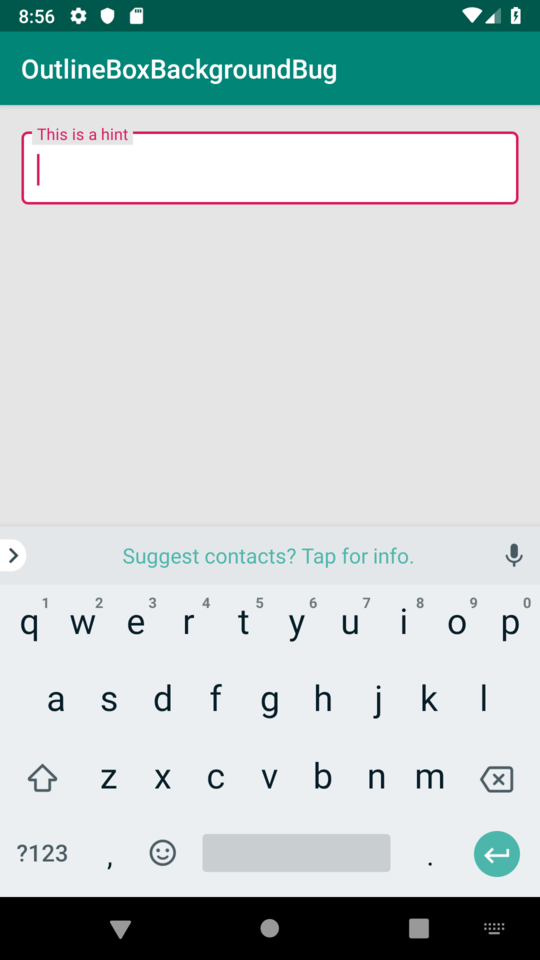

# ContrastingTextFieldBug

This project shows a visual bug where approximately half of the collapsed hint text has a background color of parent view rather than the background color of the box. 

Effectively, if your parent view's background is different than your `boxBackgroundColor`, the parent view's background color will leak into the `TextInputLayout`.

